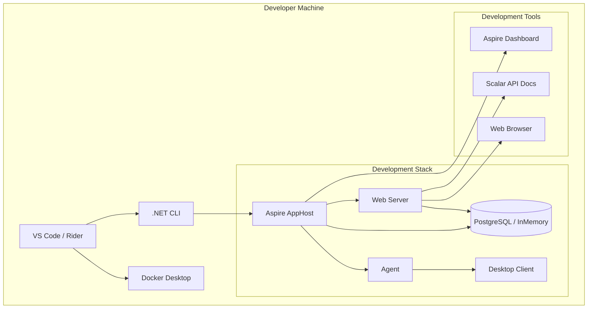

# Design Document: Cross-Platform Development Support

## Overview

This design establishes comprehensive development tooling for Linux and macOS developers working on ControlR. The solution provides IDE configurations, documentation, and scripts that enable developers to build, run, debug, and test the full stack using VS Code or JetBrains Rider with the same productivity as Windows developers using Visual Studio.

The design focuses on three key areas:
1. **IDE Integration** - Enhanced VS Code and Rider configurations for all workflows
2. **Environment Setup** - Clear documentation and verification scripts for prerequisites
3. **Flexible Database Options** - Support for Docker PostgreSQL, local PostgreSQL, or InMemory provider

## Architecture

### Component Overview



### Workflow Patterns

The design supports three primary development workflows:

1. **Full Stack with Aspire** - Uses AppHost to orchestrate all services with observability
2. **Full Stack with Docker Compose** - Uses docker-compose for PostgreSQL and Aspire Dashboard
3. **Lightweight Development** - Uses InMemory database for quick iteration without Docker

## Components and Interfaces

### VS Code Configuration

**Location**: `.vscode/`

**Files**:
- `tasks.json` - Build, test, and utility tasks
- `launch.json` - Debug configurations and compounds
- `settings.json` - Workspace settings and recommendations
- `extensions.json` - Recommended extensions

**Key Tasks**:
```json
{
  "build-solution": "dotnet build ControlR.slnx",
  "test-all": "dotnet test ControlR.slnx",
  "test-watch": "dotnet watch test --project {test-project}",
  "clean": "dotnet clean ControlR.slnx",
  "restore": "dotnet restore ControlR.slnx",
  "verify-env": "bash scripts/verify-dev-env.sh"
}
```

**Launch Configurations**:
- Individual component debugging (Server, Agent, Desktop Client)
- Compound configurations (Full Stack Debug, Full Stack Hot Reload)
- Aspire AppHost debugging
- Blazor WebAssembly debugging with browser integration

### Rider Configuration

**Location**: `.run/`

**Files**:
- `Full Stack (Debug).run.xml` - Debug all components
- `Full Stack (Hot Reload).run.xml` - Hot reload enabled
- `Aspire AppHost.run.xml` - Run via Aspire orchestration
- `Tests (All).run.xml` - Run all tests
- Individual component configurations

**Configuration Structure**:
```xml
<component name="ProjectRunConfigurationManager">
  <configuration type="CompoundRunConfigurationType">
    <toRun name="Component" type="LaunchSettings" />
    <method v="2">
      <option name="Build" />
    </method>
  </configuration>
</component>
```

### Environment Verification Script

**Location**: `scripts/verify-dev-env.sh`

**Purpose**: Validates development environment prerequisites

**Checks**:
1. .NET SDK version (10.0 or higher)
2. Docker installation and daemon status
3. Docker Compose availability
4. PostgreSQL client tools (optional)
5. Node.js for Blazor tooling (optional)
6. Platform-specific dependencies (X11 on Linux, etc.)

**Output**: Pass/fail status with remediation instructions

### Database Configuration

**Configuration Approaches**:

1. **Docker Compose (Recommended)**:
   - Uses `docker-compose/docker-compose.yml`
   - PostgreSQL with persistent volumes
   - Aspire Dashboard container
   - Automatic network configuration

2. **Local PostgreSQL**:
   - Connection string via environment variables
   - Manual database creation
   - Migration application via EF Core tools

3. **InMemory Provider**:
   - Configuration via `appsettings.Development.json`
   - No external dependencies
   - Data lost on restart (suitable for quick testing)

**Configuration File** (`appsettings.Development.json`):
```json
{
  "DatabaseProvider": "InMemory", // or "PostgreSQL"
  "ConnectionStrings": {
    "PostgreSQL": "Host=localhost;Database=controlr;Username=dev;Password=dev"
  }
}
```

### Platform-Specific Prerequisites

**Linux (Ubuntu/Debian)**:
```bash
# Required
sudo apt install dotnet-sdk-10.0 docker.io docker-compose

# Optional (for desktop client development)
sudo apt install libx11-dev libxrandr-dev libxi-dev

# Optional (for Wayland support)
sudo apt install libgstreamer1.0-0 gstreamer1.0-plugins-base gstreamer1.0-plugins-good
```

**Linux (Fedora/RHEL)**:
```bash
# Required
sudo dnf install dotnet-sdk-10.0 docker docker-compose

# Optional (for desktop client development)
sudo dnf install libX11-devel libXrandr-devel libXi-devel
```

**macOS**:
```bash
# Required
brew install dotnet@10 docker docker-compose

# Docker Desktop for Mac (GUI application)
# Download from: https://www.docker.com/products/docker-desktop
```

## Data Models

### Launch Configuration Schema

**VS Code Launch Configuration**:
```typescript
interface LaunchConfiguration {
  name: string;
  type: "coreclr" | "blazorwasm";
  request: "launch" | "attach";
  program: string;
  args?: string[];
  cwd: string;
  env?: Record<string, string>;
  preLaunchTask?: string;
  serverReadyAction?: {
    action: "openExternally";
    pattern: string;
  };
}

interface CompoundConfiguration {
  name: string;
  configurations: string[];
  preLaunchTask?: string;
  stopAll: boolean;
}
```

**Task Schema**:
```typescript
interface Task {
  label: string;
  type: "shell" | "process" | "dotnet";
  command: string;
  args?: string[];
  options?: {
    cwd: string;
  };
  problemMatcher?: string[];
  group?: {
    kind: "build" | "test";
    isDefault?: boolean;
  };
  dependsOn?: string[];
}
```

### Environment Configuration Model

```csharp
public class DevelopmentEnvironmentConfig
{
    public DatabaseProvider DatabaseProvider { get; set; }
    public string? PostgresConnectionString { get; set; }
    public bool UseDockerCompose { get; set; }
    public bool EnableHotReload { get; set; }
    public AspireConfig Aspire { get; set; }
}

public class AspireConfig
{
    public bool Enabled { get; set; }
    public string DashboardUrl { get; set; }
    public string OtlpEndpoint { get; set; }
}

public enum DatabaseProvider
{
    InMemory,
    PostgreSQL
}
```

## Correctness Properties


A property is a characteristic or behavior that should hold true across all valid executions of a system—essentially, a formal statement about what the system should do. Properties serve as the bridge between human-readable specifications and machine-verifiable correctness guarantees.

### Property Reflection

After analyzing all acceptance criteria, several patterns emerged:

1. **Configuration File Validation** - Many criteria test that configuration files exist and contain required elements (VS Code tasks, Rider run configs, documentation sections)
2. **Script Behavior** - The verification script has multiple testable behaviors that can be validated
3. **Database Provider Selection** - Configuration-based behavior for database provider selection
4. **Documentation Content** - Multiple criteria verify documentation exists and contains required content

**Consolidation Decisions**:
- Configuration file existence checks (1.1, 2.1, 5.1-5.3, 6.1-6.3, 10.1-10.5) are all examples of "required files exist with required content" - these will be individual example tests
- Verification script checks (9.1-9.4) can be consolidated into properties about script behavior
- Database configuration (4.1, 4.3) are properties about configuration-driven behavior
- Launch configuration properties (1.5, 7.4, 8.1, 8.3) are examples of "configuration contains required fields"

### Properties

Property 1: Verification script validates all required tools
*For any* required development tool (dotnet, docker, docker-compose), when the verification script runs, it should check for the tool's presence and report its status
**Validates: Requirements 9.1**

Property 2: Verification script checks .NET SDK version
*For any* .NET SDK installation, when the verification script runs, it should verify the version is 10.0 or higher and report compatibility status
**Validates: Requirements 9.2**

Property 3: Verification script tests database connectivity
*For any* database configuration (PostgreSQL or InMemory), when the verification script runs with database checks enabled, it should attempt connection and report success or failure
**Validates: Requirements 9.3**

Property 4: Verification script validates Docker daemon
*For any* system with Docker installed, when the verification script runs, it should check if the Docker daemon is running and report its status
**Validates: Requirements 9.4**

Property 5: Database provider selection based on configuration
*For any* valid database provider configuration value (InMemory or PostgreSQL), when the application starts, the correct DbContext provider should be registered in the DI container
**Validates: Requirements 4.1**

Property 6: Connection string configuration sources
*For any* valid connection string source (environment variable, appsettings.json, user secrets), when the application starts with PostgreSQL provider, it should successfully read the connection string from the configured source
**Validates: Requirements 4.3**

Property 7: Launch configurations include pre-launch tasks
*For any* launch configuration that requires building, the configuration should specify a preLaunchTask that builds the necessary dependencies
**Validates: Requirements 1.5**

## Error Handling

### Configuration Errors

**Missing Configuration Files**:
- **Detection**: Check for existence of `.vscode/tasks.json`, `.vscode/launch.json`, `.run/*.run.xml`
- **Error Message**: "Required IDE configuration files are missing. Run 'scripts/setup-ide-configs.sh' to generate them."
- **Recovery**: Provide setup script that generates missing configurations

**Invalid JSON/XML**:
- **Detection**: Parse configuration files during validation
- **Error Message**: "Configuration file {filename} contains invalid JSON/XML: {parse_error}"
- **Recovery**: Provide link to example configuration or schema

### Environment Errors

**Missing Prerequisites**:
- **Detection**: Verification script checks for required tools
- **Error Message**: ".NET SDK 10.0 not found. Install from: https://dotnet.microsoft.com/download"
- **Recovery**: Provide platform-specific installation commands

**Docker Not Running**:
- **Detection**: Check Docker daemon status via `docker info`
- **Error Message**: "Docker daemon is not running. Start Docker Desktop or run 'sudo systemctl start docker'"
- **Recovery**: Provide platform-specific Docker startup commands

**Database Connection Failures**:
- **Detection**: EF Core connection exceptions
- **Error Message**: "Failed to connect to PostgreSQL at {host}:{port}. Verify PostgreSQL is running and credentials are correct."
- **Recovery**: Suggest checking docker-compose status, connection string, or switching to InMemory provider

### Runtime Errors

**Port Conflicts**:
- **Detection**: ASP.NET Core startup exceptions for port binding
- **Error Message**: "Port {port} is already in use. Stop other services or change the port in launchSettings.json"
- **Recovery**: Provide commands to find and kill processes using the port

**Aspire Dashboard Unavailable**:
- **Detection**: HTTP request to dashboard endpoint fails
- **Error Message**: "Aspire Dashboard is not accessible at {url}. Verify the dashboard container is running."
- **Recovery**: Suggest checking docker-compose logs or AppHost output

**Hot Reload Failures**:
- **Detection**: .NET hot reload error messages
- **Error Message**: "Hot reload failed for {file}. Changes require a restart. Press Ctrl+C and restart the application."
- **Recovery**: Explain which types of changes require restart (e.g., adding new files, changing signatures)

## Testing Strategy

This feature involves primarily configuration files, documentation, and scripts rather than runtime application code. Testing will use a dual approach:

### Unit Tests

Unit tests will verify:
- Configuration file parsing and validation
- Verification script logic (mocked command execution)
- Documentation structure validation (file exists, contains required sections)
- Database provider selection logic

**Example Unit Tests**:
```csharp
[Fact]
public void LaunchConfiguration_ShouldHavePreLaunchTask()
{
    var config = LoadLaunchConfiguration("Full Stack (Debug)");
    Assert.NotNull(config.PreLaunchTask);
    Assert.Equal("build + compose", config.PreLaunchTask);
}

[Fact]
public void VerificationScript_ShouldCheckDotNetVersion()
{
    var script = new VerificationScript(mockCommandRunner);
    var result = script.CheckDotNetVersion();
    Assert.True(result.Checked);
    mockCommandRunner.Verify(x => x.Run("dotnet", "--version"));
}

[Fact]
public void DatabaseProvider_InMemory_ShouldRegisterInMemoryContext()
{
    var services = new ServiceCollection();
    var config = new DevelopmentEnvironmentConfig 
    { 
        DatabaseProvider = DatabaseProvider.InMemory 
    };
    
    services.AddDatabase(config);
    
    var provider = services.BuildServiceProvider();
    var context = provider.GetRequiredService<AppDbContext>();
    Assert.True(context.Database.IsInMemory());
}
```

### Property-Based Tests

Property tests will verify:
- Verification script behavior across different tool versions
- Configuration validation across different file structures
- Database provider selection across different configuration sources

**Property Test Configuration**:
- Minimum 100 iterations per property test
- Each test tagged with feature name and property number
- Use appropriate generators for configuration values

**Example Property Tests**:
```csharp
[Property(Iterations = 100)]
[Tag("Feature: cross-platform-dev-support, Property 1")]
public Property VerificationScript_ChecksAllRequiredTools()
{
    return Prop.ForAll(
        Gen.Elements("dotnet", "docker", "docker-compose"),
        tool =>
        {
            var script = new VerificationScript(mockCommandRunner);
            var result = script.Run();
            
            return result.Checks.Any(c => c.ToolName == tool);
        });
}

[Property(Iterations = 100)]
[Tag("Feature: cross-platform-dev-support, Property 5")]
public Property DatabaseProvider_SelectsCorrectProvider()
{
    return Prop.ForAll(
        Gen.Elements(DatabaseProvider.InMemory, DatabaseProvider.PostgreSQL),
        provider =>
        {
            var services = new ServiceCollection();
            var config = new DevelopmentEnvironmentConfig 
            { 
                DatabaseProvider = provider 
            };
            
            services.AddDatabase(config);
            var serviceProvider = services.BuildServiceProvider();
            var context = serviceProvider.GetRequiredService<AppDbContext>();
            
            return provider == DatabaseProvider.InMemory 
                ? context.Database.IsInMemory()
                : context.Database.IsRelational();
        });
}
```

### Integration Tests

Integration tests will verify:
- End-to-end workflow: run verification script, start services, verify connectivity
- Docker Compose brings up all services correctly
- Aspire AppHost orchestrates services with correct dependencies
- Database migrations apply successfully on both PostgreSQL and InMemory

**Example Integration Tests**:
```csharp
[Fact]
public async Task DockerCompose_StartsAllServices()
{
    await DockerCompose.UpAsync();
    
    var postgresHealthy = await CheckPostgresHealth();
    var aspireHealthy = await CheckAspireHealth();
    var webServerHealthy = await CheckWebServerHealth();
    
    Assert.True(postgresHealthy);
    Assert.True(aspireHealthy);
    Assert.True(webServerHealthy);
}

[Fact]
public async Task AspireAppHost_OrchestatesWithCorrectDependencies()
{
    var appHost = await DistributedApplication.CreateBuilder(args).Build();
    await appHost.StartAsync();
    
    // Verify PostgreSQL started before web server
    var postgresStartTime = GetServiceStartTime("postgres");
    var webServerStartTime = GetServiceStartTime("controlr");
    
    Assert.True(postgresStartTime < webServerStartTime);
}
```

### Manual Testing

Manual testing will verify:
- IDE integration works correctly (debugger attaches, breakpoints hit)
- Hot reload applies changes without restart
- Aspire Dashboard displays telemetry correctly
- Documentation is clear and complete
- Setup process works on fresh Linux and macOS installations

**Test Platforms**:
- Ubuntu 24.04 LTS with VS Code
- macOS Sequoia with VS Code
- Ubuntu 24.04 LTS with Rider
- macOS Sequoia with Rider

**Test Scenarios**:
1. Fresh clone → follow setup guide → run full stack
2. Make code change → verify hot reload applies
3. Set breakpoint → verify debugger pauses
4. Run tests → verify results display in IDE
5. Simulate missing prerequisite → verify error message and recovery
